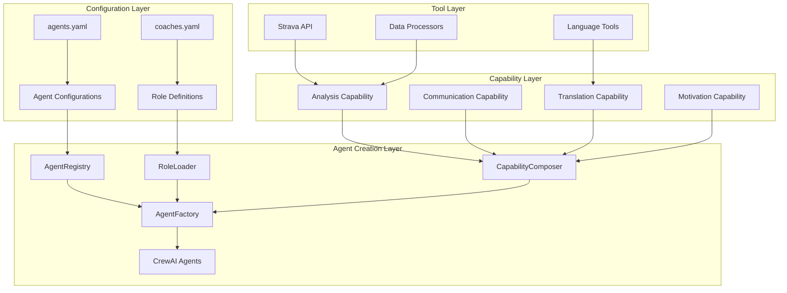

# Agent Instantiation Architecture for Agentic Coaching Solution

## Overview

This document outlines the architectural design for agent instantiation in the agentic coaching solution, providing a hybrid YAML + code approach that balances immediate simplicity with long-term extensibility.

## Current State Analysis

### Existing Components
- **Role Definitions**: Rich YAML role definitions in [`ENV/coaches.yaml`](../../ENV/coaches.yaml)
- **Agent Implementation**: Basic hardcoded agent factories in [`src/roles/agents.py`](../../src/roles/agents.py)
- **Framework**: CrewAI-based agent system

### Identified Gaps
1. **Disconnect**: Rich YAML role definitions vs. simple hardcoded agent factories
2. **No extensibility**: Current factory functions can't handle complex agent capabilities
3. **Hard to scale**: Adding new agents requires code changes in multiple places
4. **No configuration**: Agent properties are hardcoded, not configurable
5. **Missing domain logic**: No coaching-specific abstractions

## Architectural Design

### System Architecture Overview



### Core Design Principles

1. **YAML-First Configuration**: Roles defined in YAML remain the source of truth
2. **Plugin Architecture**: Capabilities can be added as plugins without changing core code
3. **Progressive Enhancement**: Start simple, add complexity as needed
4. **Type Safety**: Pydantic models for all configurations
5. **Agent Registry**: Central registry for discovering and creating agents

## Component Design

### 1. Agent Configuration Schema

```yaml
# ENV/agents.yaml - New comprehensive agent definitions
agent_definitions:
  daily_analysis_coach:
    role_reference: daily_analysis_coach  # Links to coaches.yaml
    agent_type: analyst
    capabilities:
      - workout_analysis
      - metric_interpretation
      - report_generation
    tools:
      - strava_api
      - data_processor
    memory_config:
      type: session_based
      retention_days: 30
    model_config:
      temperature: 0.3  # More analytical, less creative
      
  translator:
    role_reference: translator
    agent_type: linguistic
    capabilities:
      - translation
      - terminology_mapping
    tools:
      - language_detector
      - sports_dictionary
    model_config:
      temperature: 0.1  # Very precise translations
      
  main_coach:
    role_reference: main_coach  # To be defined in coaches.yaml
    agent_type: strategic
    capabilities:
      - athlete_management
      - training_planning
      - team_coordination
    tools:
      - calendar_integration
      - training_planner
      - athlete_database
    memory_config:
      type: long_term
      retention_days: 365
      
  motivator:
    role_reference: motivator
    agent_type: supportive
    capabilities:
      - encouragement
      - goal_setting
      - progress_celebration
    tools:
      - sentiment_analyzer
      - goal_tracker
    model_config:
      temperature: 0.7  # More creative and encouraging
```

### 2. Agent Registry and Factory Pattern

```python
# src/roles/agent_registry.py
from typing import Dict, Type, Any
from abc import ABC, abstractmethod
from crewai import Agent
from pydantic import BaseModel

class AgentCapability(ABC):
    """Base class for agent capabilities"""
    
    @abstractmethod
    def enhance_agent(self, agent: Agent) -> Agent:
        """Add this capability to an agent"""
        pass

class AgentConfig(BaseModel):
    """Configuration for an agent instance"""
    role_reference: str
    agent_type: str
    capabilities: list[str]
    tools: list[str]
    memory_config: dict[str, Any]
    model_config: dict[str, Any] = {}

class AgentRegistry:
    """Registry for agent types and capabilities"""
    
    def __init__(self):
        self._agent_types: Dict[str, Type[Agent]] = {}
        self._capabilities: Dict[str, AgentCapability] = {}
        self._role_loader = RoleLoader()
    
    def register_agent_type(self, name: str, agent_class: Type[Agent]):
        """Register a new agent type"""
        self._agent_types[name] = agent_class
    
    def register_capability(self, name: str, capability: AgentCapability):
        """Register a new capability"""
        self._capabilities[name] = capability
    
    def create_agent(self, agent_id: str, config: AgentConfig) -> Agent:
        """Create an agent from configuration"""
        # Load role definition from coaches.yaml
        role_def = self._role_loader.load_role(config.role_reference)
        
        # Create base agent
        agent = Agent(
            role=role_def.role,
            goal=role_def.goal,
            backstory=role_def.description,
            verbose=True,
            **config.model_config
        )
        
        # Apply capabilities
        for capability_name in config.capabilities:
            if capability_name in self._capabilities:
                capability = self._capabilities[capability_name]
                agent = capability.enhance_agent(agent)
        
        return agent
```

### 3. Plugin System for Capabilities

```python
# src/roles/capabilities/base.py
from abc import ABC, abstractmethod
from typing import Any, Dict, List
from crewai import Agent
from crewai.tools import BaseTool

class AgentCapability(ABC):
    """Base class for agent capabilities"""
    
    @abstractmethod
    def get_tools(self) -> List[BaseTool]:
        """Return tools provided by this capability"""
        pass
    
    @abstractmethod
    def enhance_agent_config(self, config: Dict[str, Any]) -> Dict[str, Any]:
        """Modify agent configuration"""
        pass

# src/roles/capabilities/analysis.py
class WorkoutAnalysisCapability(AgentCapability):
    """Capability for analyzing workout data"""
    
    def get_tools(self) -> List[BaseTool]:
        return [
            StravaDataTool(),
            MetricsCalculatorTool(),
            ReportGeneratorTool()
        ]
    
    def enhance_agent_config(self, config: Dict[str, Any]) -> Dict[str, Any]:
        config['allow_delegation'] = False  # Analysis agents work independently
        config['max_execution_time'] = 300   # 5 minutes for thorough analysis
        return config
```

### 4. Role-to-Agent Mapping

```python
# src/roles/role_loader.py
import yaml
from typing import Dict, Any
from pydantic import BaseModel

class RoleDefinition(BaseModel):
    """Represents a role definition from coaches.yaml"""
    name: str
    description: str
    
    @property
    def role(self) -> str:
        """Extract role name for CrewAI"""
        return self.name.replace('_', ' ').title()
    
    @property
    def goal(self) -> str:
        """Extract goal from description"""
        lines = self.description.split('\n')
        # First sentence typically contains the goal
        return lines[0].strip().rstrip('.')
    
    @property
    def backstory(self) -> str:
        """Return full description as backstory"""
        return self.description

class RoleLoader:
    """Loads role definitions from YAML files"""
    
    def __init__(self, coaches_file: str = "ENV/coaches.yaml"):
        self.coaches_file = coaches_file
        self._cache = {}
    
    def load_role(self, role_name: str) -> RoleDefinition:
        """Load a specific role definition"""
        if role_name not in self._cache:
            with open(self.coaches_file, 'r') as f:
                data = yaml.safe_load(f)
            
            # Find the role in the YAML structure
            for role_data in data.get('roles', []):
                if role_name in role_data:
                    description = role_data[role_name][0]['description']
                    self._cache[role_name] = RoleDefinition(
                        name=role_name,
                        description=description
                    )
                    break
            else:
                raise ValueError(f"Role '{role_name}' not found in {self.coaches_file}")
        
        return self._cache[role_name]
```

### 5. Configuration Schema with Evolution Support

```python
# src/roles/schemas.py
from pydantic import BaseModel, Field
from typing import Dict, Any, List, Optional
from enum import Enum

class AgentType(str, Enum):
    """Types of coaching agents"""
    ANALYST = "analyst"
    LINGUISTIC = "linguistic"
    STRATEGIC = "strategic"
    SUPPORTIVE = "supportive"

class MemoryType(str, Enum):
    """Memory configuration types"""
    SESSION_BASED = "session_based"
    SHORT_TERM = "short_term"
    LONG_TERM = "long_term"

class MemoryConfig(BaseModel):
    """Memory configuration for agents"""
    type: MemoryType
    retention_days: int = 30
    max_entries: Optional[int] = None
    persistence: bool = True

class ModelConfig(BaseModel):
    """LLM model configuration"""
    temperature: float = 0.5
    max_tokens: Optional[int] = None
    top_p: Optional[float] = None
    frequency_penalty: Optional[float] = None

class AgentConfig(BaseModel):
    """Complete agent configuration schema"""
    role_reference: str = Field(..., description="Reference to role in coaches.yaml")
    agent_type: AgentType
    capabilities: List[str] = Field(default_factory=list)
    tools: List[str] = Field(default_factory=list)
    memory_config: MemoryConfig = Field(default_factory=lambda: MemoryConfig(type=MemoryType.SESSION_BASED))
    model_config: ModelConfig = Field(default_factory=ModelConfig)
    
    # Evolution support
    version: str = Field(default="1.0", description="Configuration version for migration")
    custom_config: Dict[str, Any] = Field(default_factory=dict, description="Custom configuration for future extensions")
```

### 6. Coaching-Specific Extensions

```python
# src/roles/coaching_agents.py
from typing import Dict, Any
from crewai import Agent

class CoachingAgentMixin:
    """Mixin for coaching-specific agent functionality"""
    
    def __init__(self, athlete_context: Dict[str, Any] = None):
        self.athlete_context = athlete_context or {}
    
    def set_athlete_context(self, athlete_id: str, context: Dict[str, Any]):
        """Set context for specific athlete"""
        self.athlete_context[athlete_id] = context
    
    def get_personalized_prompt(self, base_prompt: str, athlete_id: str = None) -> str:
        """Enhance prompts with athlete-specific context"""
        if athlete_id and athlete_id in self.athlete_context:
            context = self.athlete_context[athlete_id]
            return f"{base_prompt}\n\nAthlete Context: {context}"
        return base_prompt

# Main coach role definition for coaches.yaml
MAIN_COACH_ROLE = """
main_coach:
  - description: |
      You are the head coach responsible for overall athlete development and team management.
      You coordinate with specialized coaches (analysis, translation, motivation) to provide comprehensive coaching services.
      Your responsibilities include:
      
      - Strategic Training Planning: Design long-term training periodization based on athlete goals and current fitness level.
      - Team Coordination: Orchestrate collaboration between specialized coaching agents.
      - Athlete Management: Maintain overview of multiple athletes' progress and needs.
      - Decision Making: Make high-level decisions about training modifications based on analysis reports.
      - Communication: Provide clear guidance to athletes and coordinate with support staff.
      
      You work with analysis reports from the daily analysis coach, coordinate translations for international athletes,
      and ensure motivational support is provided when needed.
      Use a professional, authoritative, yet supportive tone.
      Focus on long-term athlete development and sustainable performance improvement.
"""

# Motivator role definition
MOTIVATOR_ROLE = """
motivator:
  - description: |
      You are a sports psychologist and motivational coach specializing in endurance sports.
      Your role is to provide psychological support, motivation, and mental training guidance.
      
      Your responsibilities include:
      
      - Motivation & Encouragement: Boost athlete morale during difficult training phases.
      - Goal Setting: Help athletes set realistic and inspiring short and long-term goals.
      - Mental Training: Provide techniques for race preparation, anxiety management, and focus improvement.
      - Progress Celebration: Recognize achievements and milestones to maintain engagement.
      - Resilience Building: Help athletes overcome setbacks and maintain positive mindset.
      
      Use an encouraging, positive, and empathetic tone.
      Base your motivation on actual performance data and progress indicators.
      Provide specific, actionable mental training advice tailored to endurance sports.
"""
```

### 7. Capability Inheritance and Composition

```python
# src/roles/capability_system.py
from abc import ABC, abstractmethod
from typing import Dict, Any, List, Type
from crewai import Agent
from crewai.tools import BaseTool

class CapabilityComposer:
    """Handles composition of multiple capabilities into agents"""
    
    def __init__(self):
        self._capabilities: Dict[str, AgentCapability] = {}
        self._capability_dependencies: Dict[str, List[str]] = {}
    
    def register_capability(self, name: str, capability: AgentCapability, 
                          dependencies: List[str] = None):
        """Register a capability with optional dependencies"""
        self._capabilities[name] = capability
        self._capability_dependencies[name] = dependencies or []
    
    def compose_agent(self, base_agent: Agent, capability_names: List[str]) -> Agent:
        """Compose an agent with multiple capabilities"""
        # Resolve capability dependencies
        resolved_capabilities = self._resolve_dependencies(capability_names)
        
        # Apply capabilities in dependency order
        for capability_name in resolved_capabilities:
            if capability_name in self._capabilities:
                capability = self._capabilities[capability_name]
                base_agent = capability.enhance_agent(base_agent)
        
        return base_agent
    
    def _resolve_dependencies(self, capability_names: List[str]) -> List[str]:
        """Resolve capability dependencies in correct order"""
        resolved = []
        visited = set()
        
        def visit(name: str):
            if name in visited:
                return
            visited.add(name)
            
            # Visit dependencies first
            for dep in self._capability_dependencies.get(name, []):
                visit(dep)
            
            if name not in resolved:
                resolved.append(name)
        
        for name in capability_names:
            visit(name)
        
        return resolved

# Inheritance hierarchy for coaching capabilities
class CoachingCapability(AgentCapability):
    """Base class for all coaching-related capabilities"""
    
    def __init__(self, sport_type: str = "endurance"):
        self.sport_type = sport_type
    
    @abstractmethod
    def get_coaching_context(self) -> Dict[str, Any]:
        """Return coaching-specific context"""
        pass

class AnalysisCapability(CoachingCapability):
    """Capability for data analysis"""
    
    def get_coaching_context(self) -> Dict[str, Any]:
        return {
            "focus": "performance_metrics",
            "output_format": "technical_report",
            "target_audience": "coach"
        }
    
    def get_tools(self) -> List[BaseTool]:
        return [DataAnalysisTool(), MetricsCalculatorTool()]
    
    def enhance_agent_config(self, config: Dict[str, Any]) -> Dict[str, Any]:
        config.update({
            "temperature": 0.3,  # Analytical precision
            "allow_delegation": False,
            "max_execution_time": 300
        })
        return config
```

## Migration Path

### Phase 1: Foundation (Week 1)
**Goal**: Improve current setup with minimal changes

**Migration Steps:**
```yaml
current_state: 
  - Hardcoded agent factories in agents.py
  - Basic YAML role definitions
  - No extensibility mechanism

target_state:
  - Agent registry and factory pattern
  - Enhanced YAML configuration
  - Basic capability system

migration_steps:
  1. Create AgentRegistry and AgentConfig schemas
  2. Implement RoleLoader for coaches.yaml integration
  3. Refactor existing agents to use new factory
  4. Add agents.yaml configuration file
  5. Update AgenticCrew to use registry
```

### Phase 2: Capabilities (Week 2-3)
**Goal**: Implement core architecture components

**Migration Steps:**
```yaml
migration_steps:
  1. Create Core Components (AgentRegistry, RoleLoader, AgentConfig schemas)
  2. Migrate Existing Agents (convert create_researcher_agent() and create_writer_agent() to use registry)
  3. Add New Coaching Agents (implement daily_analysis_coach and translator using registry)
```

### Phase 3: Advanced Features (Week 4-5)
**Goal**: Add extensible capability framework

**Migration Steps:**
```yaml
migration_steps:
  1. Build Capability Framework (AgentCapability base class, CapabilityComposer)
  2. Create Tool Integration (tool binding framework, placeholder tools)
  3. Create athlete context system
  4. Add performance monitoring
  5. Implement capability hot-swapping
```

## Directory Structure

```
src/
├── roles/
│   ├── __init__.py
│   ├── config.py                 # Enhanced configuration
│   ├── schemas.py               # Pydantic schemas
│   ├── agent_registry.py        # Agent registry and factory
│   ├── role_loader.py          # YAML role loading
│   ├── capability_system.py    # Capability composition
│   ├── coaching_agents.py      # Coaching-specific extensions
│   ├── capabilities/           # Capability modules
│   │   ├── __init__.py
│   │   ├── base.py
│   │   ├── analysis.py
│   │   ├── communication.py
│   │   ├── translation.py
│   │   └── motivation.py
│   └── tools/                  # Tool implementations
│       ├── __init__.py
│       ├── strava_api.py
│       ├── data_analysis.py
│       └── language_tools.py
├── ENV/
│   ├── coaches.yaml           # Role definitions (enhanced)
│   └── agents.yaml            # Agent configurations (new)
└── main.py                    # Updated entry point
```

## Implementation Approach

### Recommended Strategy: Incremental Migration with Backward Compatibility

Start with a simple implementation that can immediately improve your current setup, then evolve toward the full architecture. This approach minimizes risk while providing immediate value.

### Immediate Next Steps

```yaml
priority_actions:
  1:
    task: "Create agents.yaml configuration file"
    time_estimate: "30 minutes"
    description: "Define your current agents in YAML format"
    
  2:
    task: "Enhance coaches.yaml with main_coach and motivator"
    time_estimate: "45 minutes" 
    description: "Add the two new role definitions"
    
  3:
    task: "Create AgentConfig schema"
    time_estimate: "1 hour"
    description: "Implement Pydantic models for configuration"
    
  4:
    task: "Build basic RoleLoader"
    time_estimate: "1.5 hours"
    description: "Create YAML loading functionality"
    
  5:
    task: "Implement simple AgentRegistry"
    time_estimate: "2 hours"
    description: "Create agent factory using configurations"
```

### Success Metrics

**Phase 1 Success**: 
- Current agents work unchanged
- New agents can be added via YAML only

**Phase 2 Success**:
- All agents use unified creation system
- Adding new agent types requires minimal code changes

**Phase 3 Success**:
- Capabilities can be mixed and matched
- New functionality can be added without modifying existing agents

## Decision Points

### Key Architectural Decisions

1. **Configuration Approach**: 
   - **Recommendation**: Start with YAML-first, add code extensions as needed
   - **Rationale**: Easier for non-developers to modify agent behavior

2. **Capability Granularity**:
   - **Recommendation**: Start with coarse-grained capabilities (analysis, communication)
   - **Rationale**: Simpler to implement, can be refined later

3. **Tool Integration Strategy**:
   - **Recommendation**: Plugin-based with late binding
   - **Rationale**: Supports your "long-term goal" of comprehensive capabilities

## Conclusion

This architecture provides:

- **Immediate Benefits**: YAML-first configuration for easy agent creation
- **Scalability**: Plugin architecture supports complex future requirements
- **Maintainability**: Clear separation of concerns and type-safe configuration
- **Flexibility**: Can evolve from simple setup to comprehensive coaching intelligence

The design balances your need for simplicity now with the long-term vision of advanced coaching capabilities including Strava integration, athlete memory, and personalized coaching styles.